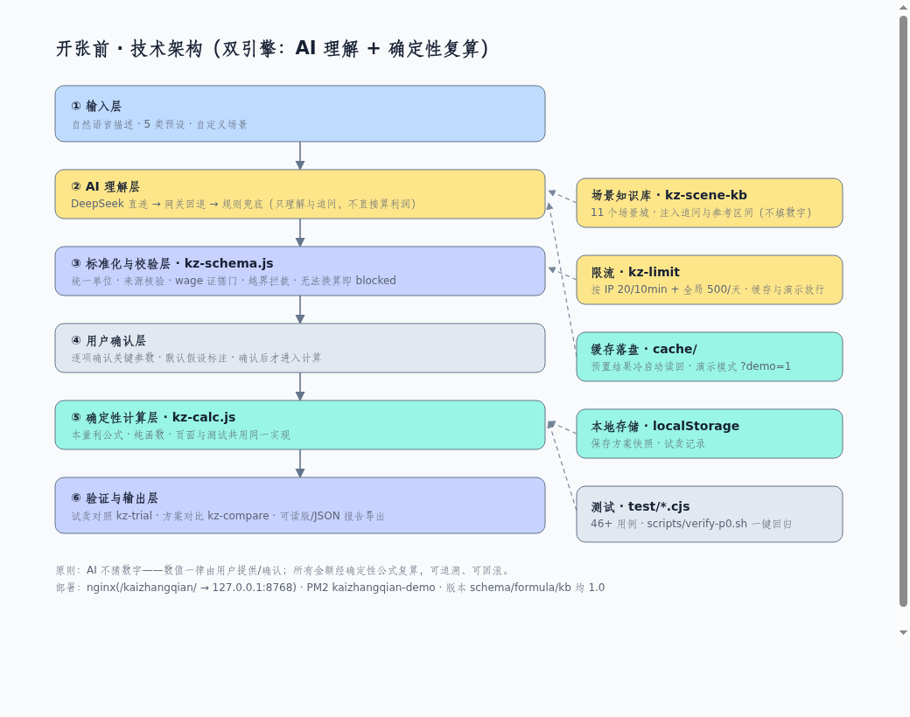

# 开张前 · 全部改动总结（P0 + P1）

> 一页看完本轮所有改动，便于核对。详细逐条见末尾「附：明细来源」。
> 线上版本：`main = origin/main = 1f3cf18`｜地址 https://wyzyw.icu/kaizhangqian/ ｜版本号：schema 1.0 / formula 1.0 / kb 1.0

---

## 一、做了什么（总览）

| 阶段 | 内容 | 状态 |
| --- | --- | --- |
| P0 | 标准化数据合同、来源核验、wage 证据门、单位换算、试卖对照、冻结演示版本等（13 项） | ✅ 已上线 |
| P1 | 演示保护、限流、场景知识库、方案对比、验证报告增强、架构图+fixtures（6 项） | ✅ 已上线 |
| 全局测试 | 本地单元 48/48、本地端到端 27/27、线上功能 26/26、浏览器渲染通过 | ✅ 全绿 |

---

## 二、技术架构

六层主流程：**输入 → AI 理解 → 标准化与校验 → 用户确认 → 确定性计算 → 验证与输出**；
右侧为支撑模块：场景知识库、限流、缓存落盘、本地存储、测试。
核心原则：**AI 不猜数字**，数值一律由用户提供/确认，所有金额由确定性公式复算。

---

## 三、P0 改动清单（13 项）

| 编号 | 对应问题 | 处理 | 验证 |
| --- | --- | --- | --- |
| FIX-01 | T-02「每周 N 天」被当成天/月 | `days` 统一换算天/月；缺「每月周数」即 blocked 并追问 | ✅ |
| FIX-02 | T-01「每小时收费 80 元」误填为 wage | 增加 wage 证据门（无时薪证据即丢弃） | ✅ |
| FIX-03 | T-04 来源短句无核验 | 每字段带 `sourceType`；原文找不到 → 标「AI 推断」 | ✅ |
| FIX-04 | P0-4 calc 混在页面、无测试 | 抽出 `kz-calc.js` 纯函数（页面与测试共用） | ✅ |
| FIX-05 | T-05 保存/导出无法复现 | 新增带 schemaVersion/来源/假设的测算快照 | ✅ |
| FIX-06 | T-08 追问 HTML 注入 | 追问/假设清单统一 `safeText()` 转义 | ✅ |
| FIX-07 | P0-2 无法换算字段被默认值静默填充 | blocked 字段不参与默认值补齐，强制用户填写 | ✅ |
| FIX-08 | P0-6 超时/回退/隐私边界 | 保留回退提示 + 新增数据流向与敏感信息提示 | ✅ |
| FIX-09 | 接口版本与静态资源 | `/health` 与 `/api/extract` 暴露版本号；托管 kz-*.js | ✅ |
| FIX-10 | T-06 / P0-5 试卖对照 | 新增 `kz-trial.js`：实际 vs 假设偏差 + 验证报告 | ✅ |
| FIX-11 | T-03 洗鞋合并成本被漏计 | 按单/按双服务即使归为 other 也计入直接耗材 | ✅ |
| FIX-12 | 部署适配 | 静态资源相对路径 + 服务端兼容 `/kaizhangqian` 前缀 | ✅ |
| FIX-13 | 试卖表单标签 | 长标签精简，避免换行破坏网格 | ✅ |

## 四、P1 改动清单（6 项）

| 编号 | 内容 | 关键点 | 验证 |
| --- | --- | --- | --- |
| P1-01 | T-07(a) 演示保护 | 缓存落盘（冷启动读回）+ 演示模式 `?demo=1`（不调 AI，断外网可演示） | ✅ |
| P1-02 | T-10 限流 | `kz-limit.js`：IP 20/10min + 全局 500/天；缓存与演示放行；429 友好提示 | ✅ |
| P1-03 | 场景知识库 | `kz-scene-kb.js`：11 个场景域；注入追问 + 前端参考区间；**绝不自动填数** | ✅ |
| P1-04 | 方案对比 | `kz-compare.js`：勾选 2–4 方案 → 统一口径对比表 + 最优提示 | ✅ |
| P1-05 | 验证报告增强 | 试卖验证报告新增可读版 Markdown/HTML 导出（可打印 PDF） | ✅ |
| P1-06 | T-09 收尾 | 架构图（见上）+ 固定测试 fixtures（`test/fixtures/*.json`） | ✅ |

---

## 五、全局测试结果（2026-09-22）

| 层次 | 结果 |
| --- | --- |
| 本地单元测试 | **48 / 48** |
| 本地端到端（mock 上游） | **27 / 27** |
| 线上功能矩阵（真实环境） | **26 / 26** |
| 浏览器渲染 + 模块加载 | 通过（无 JS 报错） |

复现：`cd /root/kz-p0 && npm test && bash scripts/verify-p0.sh && python3 scripts/live-global-test.py`

---

## 六、部署与回滚

- 部署方式：分支 `p0-hardening` → `git merge --ff-only` 入 `main` → push → `pm2 restart kaizhangqian-demo`
- 关键提交：`771add5`(P0核心) `88d1a4b`(试卖) `1b2d798`(洗鞋) `a1a044e`(部署适配) `738e47b`(演示保护) `a07ce37`(限流) `2c0c5ad`(知识库) `4d358b0`(方案对比) `6d36347`(报告) `0038171`(架构图) `1f3cf18`(全局测试)
- 回滚：`git checkout 45fa909`（或 tag `baseline-45fa909` / `kz-p0-2026-09-22`）+ `pm2 restart`

---

## 七、文件清单（本轮新增/改动）

- 模块：`kz-schema.js`、`kz-calc.js`、`kz-trial.js`、`kz-limit.js`、`kz-scene-kb.js`、`kz-compare.js`
- 测试：`test/schema|calc|trial|limit|kb|compare.test.cjs`、`test/fixtures/*.json`
- 脚本：`scripts/verify-p0.sh`、`scripts/verify-p0.mjs`、`scripts/live-global-test.py`
- 文档：`README.md`、`docs/API.md`、`docs/RELEASE-BASELINE.md`、`docs/P0-修复清单.md`、`docs/P1-构思-设计方案.md`、`docs/P1-变更记录.md`、`docs/FREEZE-2026-09-22.md`、`docs/KB-资料侦察.md`、`docs/architecture.html`、本总结
- 运行时代码：`server.cjs`、`index.html`

## 八、未做 / 待定

- **T-07(b) 完全离线包**：待确认会场是否有网；无网则做自包含离线包
- **真实逐日试卖数据**：试卖对照目前用总账/示例口径
- **P2**：账号体系 / 云端保存 / 团队协作 / 高校管理端 / 付费会员（未开发）

---

### 附：明细来源（便于逐条核对）

- P0 逐条：`docs/P0-修复清单.md`
- P1 逐条：`docs/P1-变更记录.md`
- P1 设计：`docs/P1-构思-设计方案.md`
- 冻结版本：`docs/FREEZE-2026-09-22.md`
- 资料侦察：`docs/KB-资料侦察.md`
- 全局测试：`docs/全局测试报告_20260922.md`
